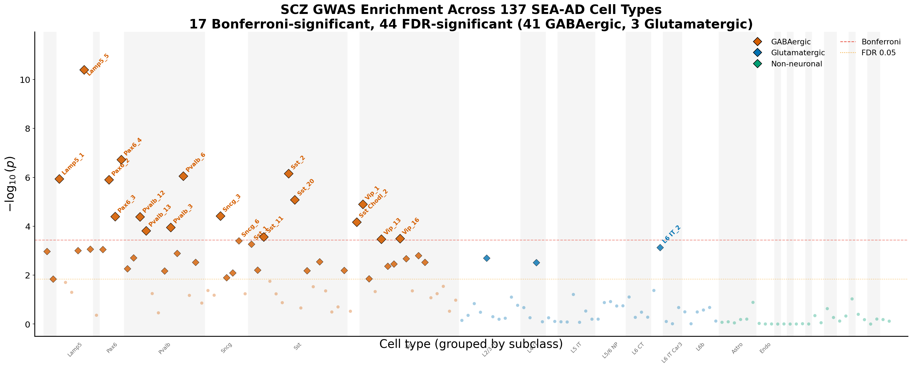
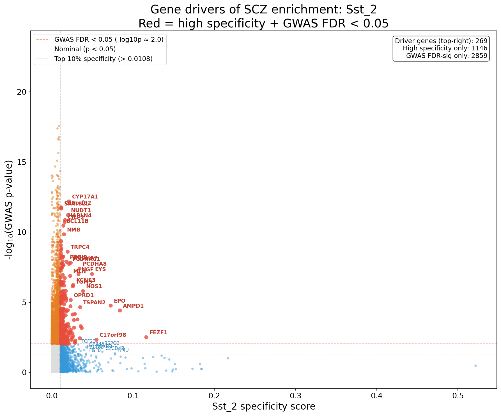
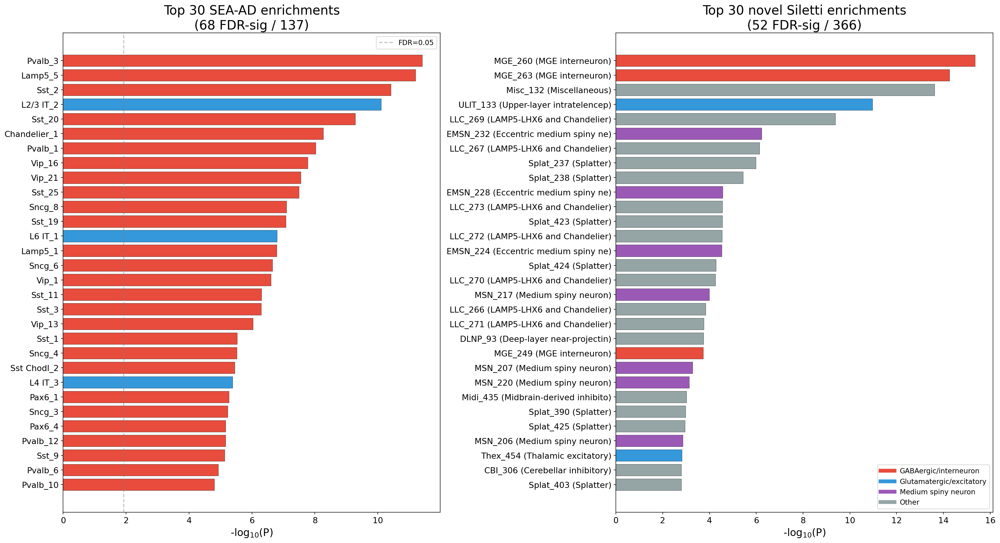
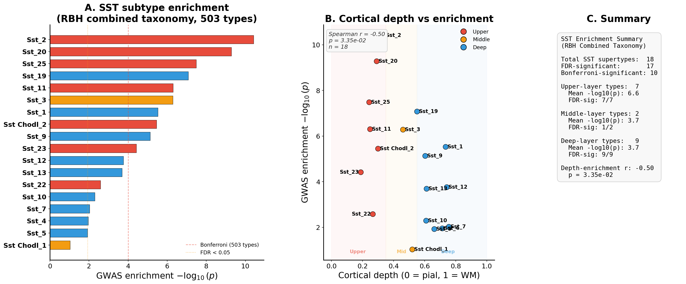
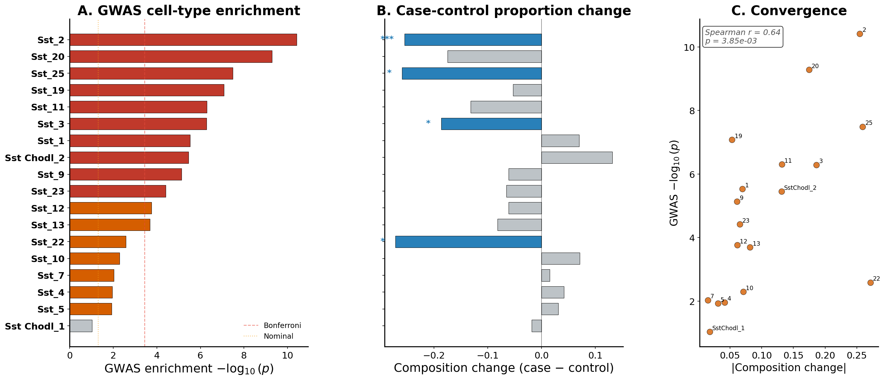
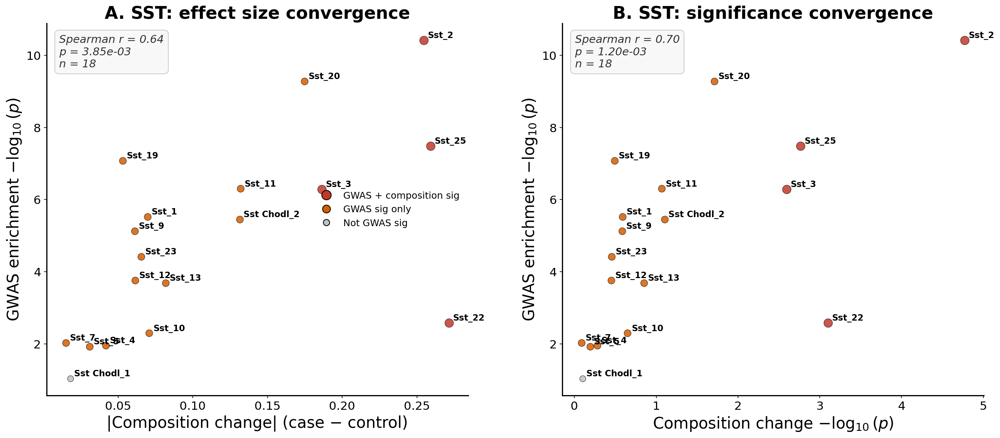

# RNAseq Expression Specificity: SCZ GWAS Enrichment Results

This document summarizes the core RNA-seq-based cell-type enrichment results for schizophrenia (SCZ) genetic risk, and their intersection with case-control compositional changes from post-mortem snRNA-seq.

---

## 1. Cell-Type Specificity and GWAS Enrichment

### Method

For each of 137 SEA-AD supertypes, cell-type specificity scores were computed (column-normalize to equalize library sizes, then row-normalize so each gene sums to 1.0 across types). MAGMA-style OLS regression tests whether genes specific to each type carry excess SCZ GWAS signal:

```
GWAS_Z ~ specificity + log(gene_size) + log(n_snps) + log(N)
```

### SEA-AD-Only Results (137 supertypes)

| Metric | Value |
|--------|-------|
| Total supertypes tested | 137 |
| Genes tested | 17,160 |
| FDR-significant (q < 0.05) | 44 |
| Bonferroni-significant | 17 |
| GABAergic FDR-sig | 41 |
| Glutamatergic FDR-sig | 3 |
| Non-neuronal FDR-sig | 0 |

**Key finding:** SCZ genetic risk is overwhelmingly concentrated in GABAergic interneurons (41/44 = 93% of significant types), with SST, Pvalb, Lamp5, Pax6, Vip, and Sncg subtypes all represented.

<p align="center">

</p>

**Figure 1.** SEA-AD Manhattan scatter showing GWAS enrichment across all 137 cell types, grouped by subclass. Diamonds indicate significance; orange = GABAergic, blue = Glutamatergic, green = Non-neuronal. Nearly all signal is in GABAergic interneurons.

### Top 10 Enriched Cell Types (SEA-AD)

| Rank | Cell type | Beta | FDR p-value |
|------|-----------|------|-------------|
| 1 | Lamp5_5 | 9.77 | 5.55e-09 |
| 2 | Pax6_4 | 5.23 | 1.30e-05 |
| 3 | Sst_2 | 6.58 | 2.88e-05 |
| 4 | Pvalb_6 | 5.45 | 2.88e-05 |
| 5 | Lamp5_1 | 5.68 | 2.88e-05 |
| 6 | Pax6_2 | 4.03 | 2.88e-05 |
| 7 | Sst_20 | 6.12 | 1.61e-04 |
| 8 | Vip_1 | 3.95 | 2.14e-04 |
| 9 | Sncg_3 | 3.50 | 5.13e-04 |
| 10 | Pax6_3 | 3.77 | 5.13e-04 |

### Conditional Analysis (Forward Selection)

Forward stepwise selection identified **18 independently enriched supertypes** — cell types carrying non-redundant SCZ signal after conditioning on all previously accepted types.

<p align="center">
</p>

**Figure 2.** Conditional analysis. Each point is an independently enriched cell type; x-axis shows marginal significance, y-axis shows conditional significance after accounting for all previously accepted types. Points above the p = 0.05 line carry independent signal. Colored by subclass.

| Step | Cell type | Subclass | Marginal p | Conditional p | Conditional beta |
|------|-----------|----------|------------|---------------|------------------|
| 1 | Lamp5_5 | Lamp5 | 4.05e-11 | 4.05e-11 | 9.77 |
| 2 | Pax6_4 | Pax6 | 1.90e-07 | 2.69e-06 | 4.70 |
| 3 | Sst_2 | Sst | 6.95e-07 | 1.16e-05 | 5.77 |
| 4 | Pvalb_6 | Pvalb | 8.79e-07 | 6.49e-05 | 4.40 |
| 5 | Lamp5_1 | Lamp5 | 1.15e-06 | 2.65e-03 | 3.43 |
| 6 | Pax6_2 | Pax6 | 1.26e-06 | 4.77e-04 | 2.87 |
| 7 | Sst_20 | Sst | 8.22e-06 | 4.68e-03 | 3.78 |
| 8 | Vip_1 | Vip | 1.25e-05 | 4.45e-04 | 3.12 |
| 9 | Sncg_3 | Sncg | 3.80e-05 | 5.66e-03 | 2.28 |
| 10 | Pax6_3 | Pax6 | 4.06e-05 | 1.77e-02 | 2.05 |
| 11 | Pvalb_12 | Pvalb | 4.12e-05 | 1.34e-02 | 2.83 |
| 12 | Sst Chodl_2 | Sst Chodl | 6.71e-05 | 4.57e-03 | 2.51 |
| 13 | Pvalb_13 | Pvalb | 1.53e-04 | 1.26e-02 | 2.16 |
| 14 | Sst_1 | Sst | 5.38e-04 | 7.64e-03 | 1.74 |
| 15 | L6 IT_2 | L6 IT | 7.37e-04 | 1.28e-04 | 1.99 |
| 16 | Pvalb_5 | Pvalb | 1.27e-03 | 3.71e-02 | 1.41 |
| 17 | L2/3 IT_2 | L2/3 IT | 1.99e-03 | 1.44e-02 | 2.24 |
| 18 | L4 IT_3 | L4 IT | 3.05e-03 | 8.56e-03 | 2.24 |

**Interpretation:** Even after conditioning, multiple subtypes within Sst (3 types), Pvalb (4 types), Pax6 (3 types), and Lamp5 (2 types) remain independently significant. This indicates genuine subtype-specific enrichment, not just shared interneuron gene programs. The three glutamatergic types (L6 IT_2, L2/3 IT_2, L4 IT_3) survive conditioning, suggesting a weaker but real excitatory neuron signal.

### Gene Drivers: Example for Sst_2

For each enriched cell type, "driver genes" are identified as genes in the top 10% of cell-type specificity AND GWAS FDR < 0.05. These are the genes that make a cell type enriched for SCZ risk.

<p align="center">

</p>

**Figure 3.** Gene driver scatter for Sst_2. X-axis: cell-type specificity score; Y-axis: -log10(GWAS p-value). Red points (top-right quadrant) are driver genes — both highly specific to Sst_2 and strongly associated with SCZ. 269 driver genes identified. Key genes labeled include CYP17A1, GRIN2D, MAD1L1, and CACNA1C.

---

## 2. RBH Combined Taxonomy (SEA-AD + Siletti)

### Motivation

SEA-AD covers neocortical cell types with fine resolution. The Siletti et al. (2023) whole-brain atlas adds 461 clusters spanning hippocampus, amygdala, thalamus, and other regions. MetaNeighbor reciprocal best hits (RBH) identified 95 Siletti clusters that are transcriptomically equivalent to SEA-AD types. The combined taxonomy keeps all 137 SEA-AD types plus 366 novel Siletti clusters = **503 total types**.

### RBH Combined Enrichment Results

| Metric | Value |
|--------|-------|
| Total types | 503 |
| SEA-AD types | 137 |
| Novel Siletti clusters | 366 |
| FDR-significant | 120 (68 SEA-AD + 52 Siletti) |
| Bonferroni-significant | 54 |

<p align="center">

</p>

**Figure 4.** Top 30 enrichments from the RBH combined taxonomy, split by source. Left: SEA-AD types (68 FDR-sig) dominated by GABAergic interneurons. Right: novel Siletti clusters (52 FDR-sig) dominated by MGE interneuron clusters and LAMP5-LHX6 types from subcortical brain regions. Colored by broad cell class.

### Top 15 Enriched Types (RBH Combined)

| Rank | Cell type | Beta | FDR p-value | Source |
|------|-----------|------|-------------|--------|
| 1 | MGE_260 | 61.31 | 2.23e-13 | Siletti |
| 2 | MGE_263 | 54.62 | 1.40e-12 | Siletti |
| 3 | Misc_132 | 38.17 | 3.98e-12 | Siletti |
| 4 | Pvalb_3 | 47.22 | 4.85e-10 | SEA-AD |
| 5 | Lamp5_5 | 40.00 | 6.43e-10 | SEA-AD |
| 6 | ULIT_133 | 47.68 | 9.19e-10 | Siletti |
| 7 | Sst_2 | 38.35 | 2.75e-09 | SEA-AD |
| 8 | L2/3 IT_2 | 34.07 | 4.98e-09 | SEA-AD |
| 9 | LLC_269 | 43.79 | 2.33e-08 | Siletti |
| 10 | Sst_20 | 39.16 | 2.64e-08 | SEA-AD |
| 11 | Chandelier_1 | 30.82 | 2.49e-07 | SEA-AD |
| 12 | Pvalb_1 | 29.93 | 4.01e-07 | SEA-AD |
| 13 | Vip_16 | 30.85 | 6.52e-07 | SEA-AD |
| 14 | Vip_21 | 24.82 | 1.00e-06 | SEA-AD |
| 15 | Sst_25 | 33.71 | 1.09e-06 | SEA-AD |

**Key finding:** The top-ranked types include Siletti MGE (medial ganglionic eminence) clusters that represent interneuron progenitors or non-neocortical interneurons. These whole-brain interneuron populations carry even stronger SCZ signal than any individual neocortical subtype, consistent with SCZ being a brain-wide interneuron disorder rather than a purely cortical one.

---

## 3. SST Interneurons: Deep Dive

SST interneurons warrant focused analysis because they are the most enriched subclass and include multiple independently significant subtypes. The figure below uses enrichment results from the **RBH combined taxonomy** (503 types: 137 SEA-AD + 366 novel Siletti) rather than the SEA-AD-only analysis, providing a more stringent test of SST enrichment in a broader cell-type context. Cortical depth is from SEA-AD MERFISH spatial transcriptomics (weighted average of MERFISH + Xenium platforms; 0 = pial surface, 1 = white matter boundary).

<p align="center">

</p>

**Figure 5.** SST subtype deep dive using RBH combined taxonomy enrichment + MERFISH cortical depth. A) GWAS enrichment per SST subtype in the 503-type RBH combined context — 17/18 SST types are FDR-significant, 10 are Bonferroni-significant. Bars colored by cortical layer: red = Upper (depth < 0.35), orange = Middle, blue = Deep. B) Cortical depth vs GWAS enrichment. Upper-layer SST types carry stronger enrichment (Spearman r = −0.50, p = 0.034). C) Summary statistics.

### SST enrichment by cortical layer (RBH combined)

| Layer | Types | Mean −log₁₀(p) | FDR-significant |
|-------|-------|-----------------|-----------------|
| Upper (depth < 0.35) | 7 | 6.6 | 7/7 (100%) |
| Middle (0.35–0.55) | 2 | 3.7 | 1/2 (50%) |
| Deep (≥ 0.55) | 9 | 3.7 | 9/9 (100%) |

**Key finding:** All 7 upper-layer SST types are FDR-significant with a mean −log₁₀(p) of 6.6 — nearly twice the mean of deep-layer types (3.7). The depth–enrichment correlation (r = −0.50, p = 0.034) confirms that SST subtypes positioned in superficial cortical layers carry disproportionately strong SCZ genetic signal, even when tested in the full 503-type RBH combined taxonomy.

---

## 4. Intersection with Case-Control Compositional Changes

### Data

Case-control compositional changes from Endresz et al. (in prep) 7-cohort snRNA-seq meta-analysis of SCZ (crumblr model). This dataset reports beta coefficients estimating the change in cell-type proportion in SCZ cases vs. controls across ~100 cell types matching SEA-AD supertypes.

### Hypothesis

If SCZ genetic risk is mediated through specific cell types, we might expect those same cell types to show altered proportions in post-mortem SCZ brains (either increased vulnerability leading to cell loss, or compensatory changes).

### All Cell Types (n = 109 matched)

| Comparison | Spearman r | p-value |
|------------|-----------|---------|
| GWAS beta vs composition beta | -0.181 | 5.92e-02 |
| |Composition beta| vs GWAS -log10(p) | -0.104 | 2.83e-01 |

**No significant correlation across all types.** The cell types with the strongest GWAS enrichment (GABAergic interneurons) are not systematically the ones with the largest compositional changes across all types. This is expected: the composition data also captures non-genetic effects (medication, post-mortem interval, reactive gliosis) that dilute the genetic signal.

### SST Interneurons Specifically (n = 18)

| Comparison | Spearman r | p-value |
|------------|-----------|---------|
| |Composition beta| vs GWAS -log10(p) | **0.645** | **3.85e-03** |
| Composition -log10(p) vs GWAS -log10(p) | **0.701** | **1.20e-03** |
| Composition beta vs GWAS beta (signed) | -0.494 | 3.70e-02 |

**Strong convergence within SST interneurons.** SST subtypes with the strongest GWAS enrichment are the same ones most affected in SCZ brains. The negative signed correlation (r = -0.494) indicates that the most genetically enriched SST types tend to be *decreased* in SCZ — consistent with genetic risk leading to vulnerability or depletion of these specific interneuron populations.

<p align="center">

</p>

**Figure 6.** SST dual-hit analysis. A) GWAS enrichment per SST subtype (ranked); B) Case-control composition change — blue bars are significantly depleted in SCZ (FDR < 0.05), asterisks mark significance; C) Correlation between |composition change| and GWAS enrichment (Spearman r = 0.64, p = 3.85e-3). Subtypes like Sst_2 and Sst_25 are both highly enriched genetically AND depleted in SCZ brains.

### SST Subtypes: GWAS Enrichment vs Composition

| SST subtype | GWAS -log10(p) | GWAS sig | Comp. beta | Comp. FDR |
|-------------|---------------|----------|------------|-----------|
| Sst_2 | 10.4 | *** | -0.255 | 0.001 |
| Sst_20 | 9.3 | *** | -0.175 | 0.192 |
| Sst_25 | 7.5 | *** | -0.259 | 0.037 |
| Sst_19 | 7.1 | *** | -0.053 | 0.640 |
| Sst_11 | 6.3 | *** | -0.132 | 0.405 |
| Sst_3 | 6.3 | *** | -0.186 | 0.046 |
| Sst_1 | 5.5 | *** | +0.070 | 0.570 |
| Sst Chodl_2 | 5.5 | *** | +0.131 | 0.390 |
| Sst_9 | 5.1 | *** | -0.061 | 0.570 |
| Sst_23 | 4.4 | *** | -0.065 | 0.652 |

**Sst_2** is the standout: the 3rd most enriched SEA-AD type for SCZ GWAS signal (FDR = 2.88e-05) AND the most significantly depleted SST subtype in SCZ post-mortem tissue (FDR = 0.001, beta = -0.255). **Sst_25** and **Sst_3** show a similar dual-hit pattern (both GWAS-enriched and compositionally depleted at FDR < 0.05).

<p align="center">

</p>

**Figure 7.** Correlation between GWAS enrichment and composition change within SST interneurons. A) Effect size convergence: |composition change| vs GWAS -log10(p), r = 0.64, p = 3.85e-3. Dark red points are dual-hit types (both GWAS and composition FDR-significant). B) Significance convergence: composition -log10(p) vs GWAS -log10(p), r = 0.70, p = 1.20e-3. Sst_2 is the extreme dual-hit in both panels.

---

## 5. Interpretation

### Why GABAergic interneurons?

The enrichment of SCZ genetic risk in GABAergic interneurons — especially SST and Pvalb subtypes — is consistent with the **GABAergic hypothesis of schizophrenia**: that deficits in cortical inhibition, particularly from SST+ and PV+ interneurons, produce the disinhibition of pyramidal cell circuits that underlies psychotic symptoms.

### Why specific SST subtypes?

Not all SST subtypes are equally enriched. Upper-layer SST types (those positioned in cortical layers 1-3) tend to carry stronger enrichment than deep-layer SST types. The conditionally independent types (Sst_2, Sst_20, Sst_1) each carry non-redundant genetic signal, suggesting distinct biological pathways converge on different SST populations.

### The case-control convergence

The convergence of GWAS enrichment and compositional depletion on the same SST subtypes suggests a causal chain:

```
SCZ risk variants
    -> alter expression of genes specific to SST subtypes
    -> impair development/maintenance of those subtypes
    -> reduced SST subtype proportions in SCZ brains
    -> cortical circuit disinhibition
    -> psychotic symptoms
```

This is speculative but is the simplest model consistent with both the genetic (GWAS enrichment) and post-mortem (composition depletion) data pointing to the same cell types.

### Caveats

1. The composition changes are from post-mortem tissue and may reflect medication effects or disease progression, not purely genetic etiology
2. The correlation within SST (n = 18) is significant but based on a modest sample size — it should be validated in independent cohorts
3. The absence of a pan-cell-type correlation (r = -0.10) means this is a subclass-specific phenomenon, not a general rule

---

## 6. Figure Summary

| Figure | File | Description |
|--------|------|-------------|
| 1 | `results/figures/manuscript/fig1_seaad_manhattan.png` | SEA-AD Manhattan scatter (137 types, grouped by subclass) |
| 3 | `results/figures/gene_drivers/gene_driver_scatter_Sst_2.png` | Gene driver scatter for Sst_2 (exemplar) |
| 4 | `results/figures/rbh_combined_taxonomy_top_enrichments.png` | Top 30 enrichments: SEA-AD vs novel Siletti |
| 5 | `results/figures/manuscript/fig4_sst_rbh_depth.png` | SST deep dive: RBH combined enrichment + MERFISH depth (3-panel) |
| 6 | `results/figures/manuscript/fig2_sst_dual_hit.png` | SST dual-hit: GWAS + composition side-by-side |
| 7 | `results/figures/manuscript/fig3_sst_composition_correlation.png` | SST composition correlation (2-panel) |

---

## 7. Key Output Files

| File | Description |
|------|-------------|
| `results/tables/seaad_magma_scz_enrichment_all_supertypes.csv` | SEA-AD enrichment (137 types) |
| `results/tables/rbh_combined_enrichment.csv` | RBH combined enrichment (503 types) |
| `results/tables/independent_supertypes_conditional.csv` | Conditional analysis (18 types) |
| `results/tables/gwas_vs_casecontrol_composition.csv` | GWAS vs composition merged data |

---

## 8. Scripts

| Script | Description |
|--------|-------------|
| `scripts/01_compute_specificity.py` | Compute cell-type specificity from SEA-AD snRNA-seq |
| `scripts/02_magma_enrichment.py` | MAGMA-style gene property analysis |
| `scripts/10_combined_taxonomy.py` | Build RBH combined taxonomy and enrichment |
| `scripts/11_gene_driver_scatter.py` | Gene driver scatter plots |
| `scripts/13_gwas_vs_composition.py` | GWAS vs case-control composition analysis |
| `scripts/generate_markdown_figures.py` | Generate figures for this document |
